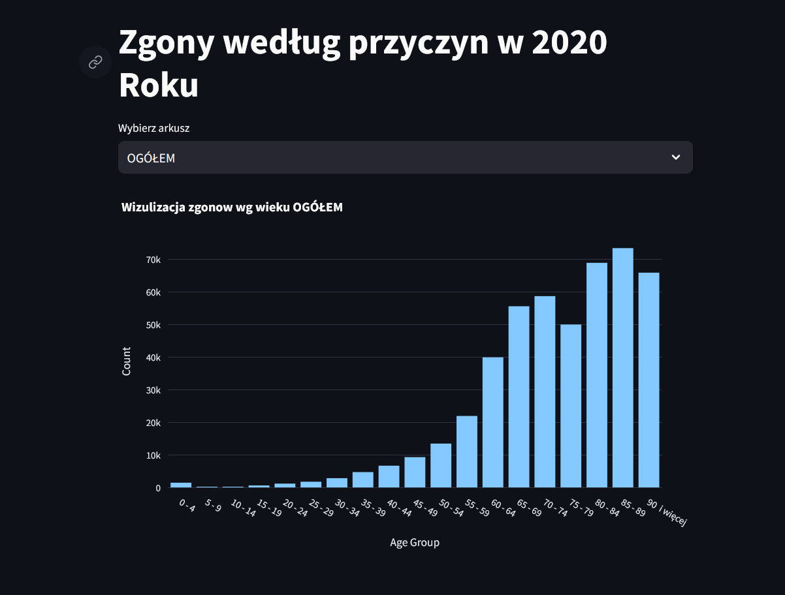
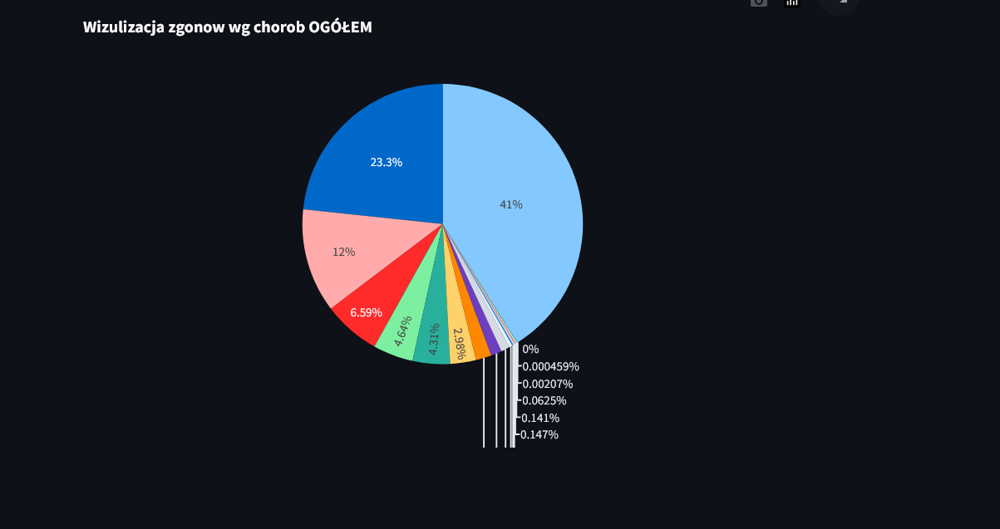

# Aktywacja,instalacja i urchomienie programu

### Aktywacja Wirtualnego Środowiska (venv):

- **Windows**:

```
venv\Scripts\activate
```

- **MacOS**:

```
source venv/bin/activate
```

### Instalaja paczek

```
python3 -m pip install -r requirements.txt
```

### Uruchomienie Programu:

Użyj tej komendy w terminalu po aktywowaniu wirtualnego środowiska:

```bash
streamlit run sciezka/do/app.py
```

Upewnij się, że zastąpisz "sciezka/do/app.py" właściwą ścieżką do pliku app.py w Twoim projekcie.

Aplikacja będzie dostępna pod adresem: http://localhost:8501

# O Programie:

Program jest narzędziem do wizualizacji danych dotyczących zgonów według przyczyn w roku 2020, wykorzystującym Pythona oraz biblioteki Streamlit, Pandas i Plotly Express.

### Screeny z Programu:




```

```
